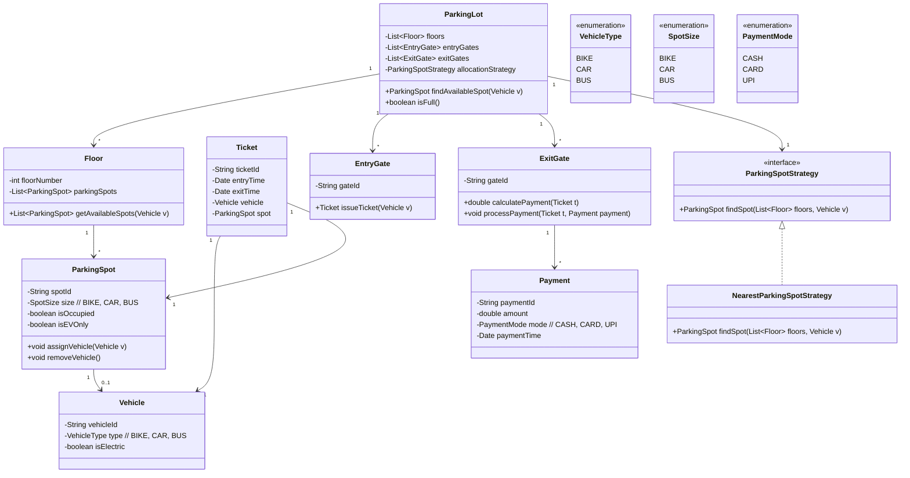

# Parking Lot

> Class Diagram

```mermaid
classDiagram
    direction TB

    class ParkingLot {
        -List~Floor~ floors
        -List~EntryGate~ entryGates
        -List~ExitGate~ exitGates
        -ParkingSpotStrategy allocationStrategy
        +ParkingSpot findAvailableSpot(Vehicle v)
        +boolean isFull()
    }

    class Floor {
        -int floorNumber
        -List~ParkingSpot~ parkingSpots
        +List~ParkingSpot~ getAvailableSpots(Vehicle v)
    }

    class ParkingSpot {
        -String spotId
        -SpotSize size   // BIKE, CAR, BUS
        -boolean isOccupied
        -boolean isEVOnly
        +void assignVehicle(Vehicle v)
        +void removeVehicle()
    }

    class Vehicle {
        -String vehicleId
        -VehicleType type  // BIKE, CAR, BUS
        -boolean isElectric
    }

    class Ticket {
        -String ticketId
        -Date entryTime
        -Date exitTime
        -Vehicle vehicle
        -ParkingSpot spot
    }

    class EntryGate {
        -String gateId
        +Ticket issueTicket(Vehicle v)
    }

    class ExitGate {
        -String gateId
        +double calculatePayment(Ticket t)
        +void processPayment(Ticket t, Payment payment)
    }

    class Payment {
        -String paymentId
        -double amount
        -PaymentMode mode  // CASH, CARD, UPI
        -Date paymentTime
    }

    %% Strategy Interface
    class ParkingSpotStrategy {
        <<interface>>
        +ParkingSpot findSpot(List~Floor~ floors, Vehicle v)
    }

    class NearestParkingSpotStrategy {
        +ParkingSpot findSpot(List~Floor~ floors, Vehicle v)
    }

    %% Enums
    class VehicleType {
        <<enumeration>>
        BIKE
        CAR
        BUS
    }

    class SpotSize {
        <<enumeration>>
        BIKE
        CAR
        BUS
    }

    class PaymentMode {
        <<enumeration>>
        CASH
        CARD
        UPI
    }

    %% Relationships
    ParkingLot "1" --> "*" Floor
    ParkingLot "1" --> "*" EntryGate
    ParkingLot "1" --> "*" ExitGate
    ParkingLot "1" --> "1" ParkingSpotStrategy
    Floor "1" --> "*" ParkingSpot
    ParkingSpot "1" --> "0..1" Vehicle
    Ticket "1" --> "1" Vehicle
    Ticket "1" --> "1" ParkingSpot
    ExitGate "1" --> "*" Payment
    ParkingSpotStrategy <|.. NearestParkingSpotStrategy

```
